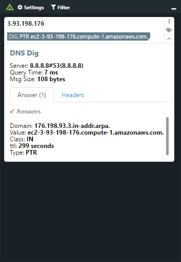
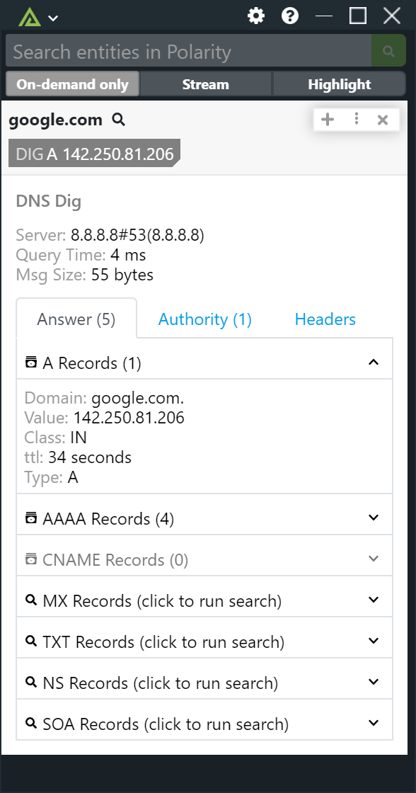

# Polarity Dig Integration


> This integration should only be run in `On Demand Only` mode

|  |  
|---| --- | 
|*dig IP information* | *dig domain information* |


The Polarity dig integration leverages the "node-dig-dns" library which provides a simple node wrapper for the unix/linux/macos dig command (domain information grope).  

For domains this integration runs the dig command:
```
dig <domain> ANY @dns-server
```

For IP Addresses this integration does a reverse lookup:

```
dig -x <ip-address> ANY @dns-server
```

## Installing Dig

For this integration to work you must have the `dig` command line tool installed on your Polarity Server.  To install `dig` you can install the `bind-utils` package via `yum`:

```
sudo yum install bind-utils -y
```

## Dig Integration Options

### DNS Server
The DNS Server (host or IP) to perform lookups against.  If blank, your default DNS server will be used.  If an invalid or unreachable DNS Server is provided your `dig` requests will eventually time out.

### Private IPs Only

If checked, the integration will only look up private (RFC-1918) IP addresses.

## About Polarity

Polarity is a memory-augmentation platform that improves and accelerates analyst decision making.  For more information about the Polarity platform please see:

https://polarity.io/
